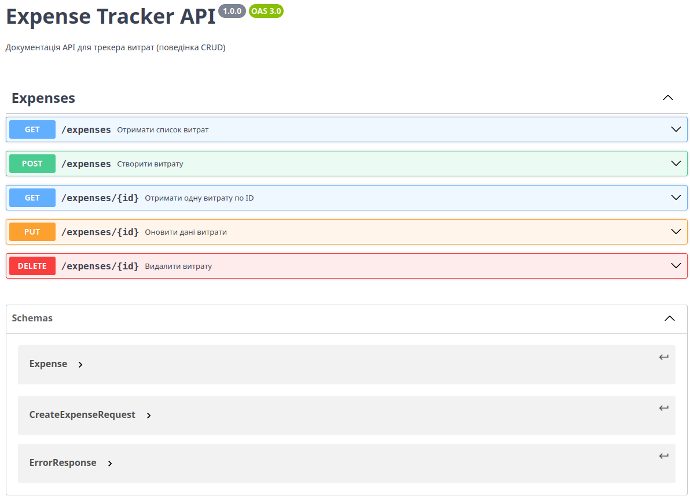

## API Документація

Проект реалізує RESTful API згідно зі специфікацією OpenAPI 3.0.

📄 **Повний контракт:** [openapi.yaml](docs/api/openapi.yaml)

### Попередній перегляд:

## 🚀 CI/CD та Delivery

У проєкті реалізовано автоматичний CI/CD конвеєр за допомогою **GitHub Actions**.

### Підхід до Delivery
Використано **Варіант A: GHCR**.
При кожному оновленні гілки `main`, система автоматично збирає Docker-образ та публікує його в реєстр GitHub Container Registry.

* 📂 **Репозиторій:** [Посилання на репозиторій](https://github.com/dovbogray/expenses_tracker)
* 📦 **Docker Image (Package):** [Посилання на пакет в GHCR](https://github.com/dovbogray/expenses_tracker/pkgs/container/expense-tracker-api)
* ✅ **Історія запусків CI:** [GitHub Actions](https://github.com/dovbogray/expenses_tracker/actions)

---

## 🛠 Локальний запуск

Ви можете запустити проект двома способами: через Node.js або через Docker.

### Варіант 1: Через Docker (Рекомендовано)

**1. Збірка образу**

docker build -t expense-tracker-api .

**2. Запуск контейнера. Сервер буде доступний на порту 5000.**

docker run -d -p 5000:5000 --name expense-container --rm expense-tracker-api

**3. Зупинка контейнера.**

docker stop expense-container

### Варіант 2: Через Node.js (Для розробки)

**1. Встановлення залежностей**

npm install

**2. Запуск тестів**

npm test

**3. Запуск сервера**

npm start
