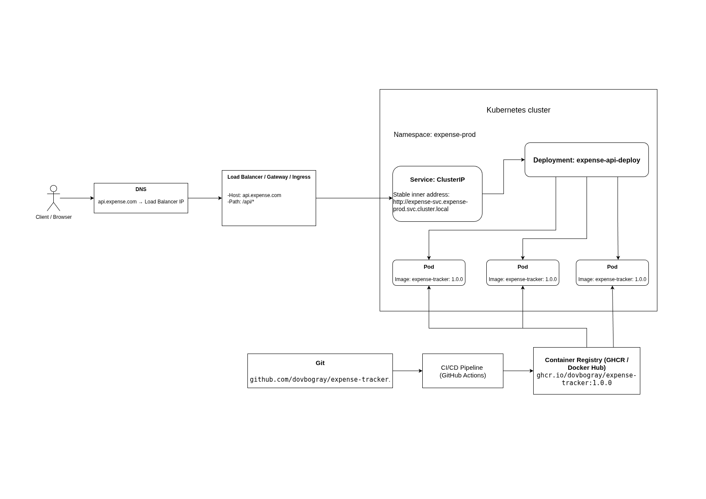

# Теоретична схема Kubernetes-додатку

## Схема архітектури

## Опис дизайну

Моделюється бекенд веб-застосунку **Expense Tracker**, який розгорнуто в ізольованому Kubernetes namespace під назвою `expense-prod`. Зовнішній трафік надходить на домен `api.expense.com` через **Ingress Controller**, який маршрутизує запити за шляхом `/api` до внутрішнього Service, а той балансує навантаження між Pod-ами . 

Для забезпечення відмовостійкості та стабільної роботи під навантаженням у схемі закладено **3 екземпляри (Pods)** застосунку.Процес доставки коду автоматизовано: зміни з **Git** через **CI/CD** (GitHub Actions) збираються в Docker-образ і відправляються в **Container Registry**, звідки Kubernetes завантажує актуальну версію образу при старті Pod-ів.